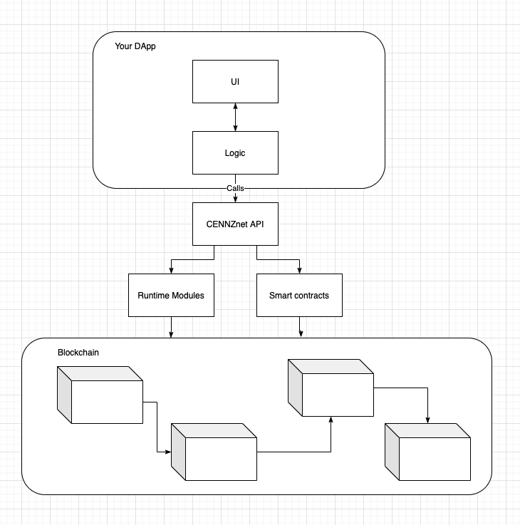
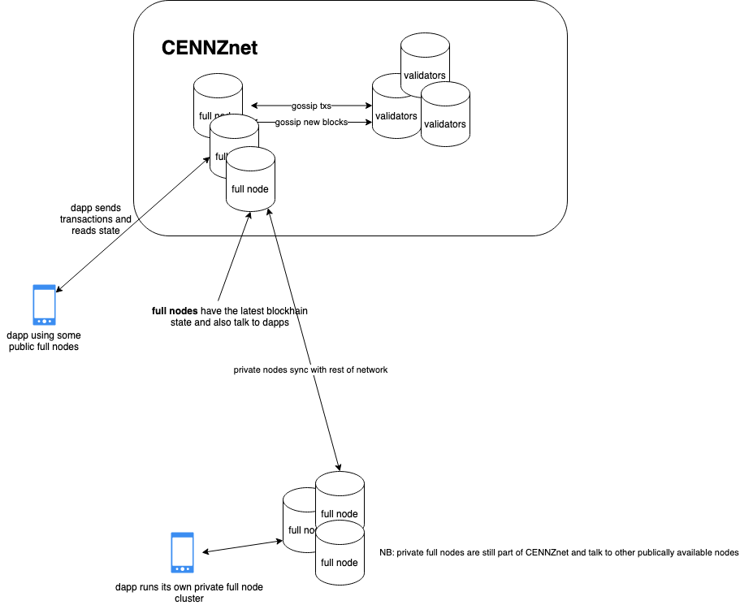

# How to build a DApp

A DApp(Decentralised App) is an app that uses a blockchain as the backend data store. The blockchain gives your app the benefits of decentralized storage and peer-to-peer communication.

To build a DApp with CENNZnet, you will need:
* Build a frontend in your chosen framework as long as it is compatible with JavaScript.
* Interact with CENNZnet's MainNet using the CENNZnet (JavaScript) API.
* You may need to write and deploy Smart Contracts if you need custom methods that's not provided by the core modules.

## The architecture of a DApp

As described in the [CENNZnet technical overview](Getting-started/CENNZnet-technical-overview), your DApp can communicate with CENNZnet in 2 ways:
1) Calling methods of the runtime modules
2) Calling smart contracts

## A DApp's communication with a node

To communicate with a blockchain, you will need to connect to a node. You can connect to a node via the [CENNZnet API](https://github.com/cennznet/api.js) or [CENNZnet.io](http://cennznet.io/).

While you are working on your DApp, you can typically connect to an existing node on the MainNet. But for the best performance in a production environment, you may run and connect to your own node. 

To run your own node, please see [Running-a-Full-Node](Network-participating/Node-operating/Running-a-Full-Node)

## Storage considerations

### Storing large data
You can store any data on the blockchain, but it's costly to store large data on the blockchain. This is because history is kept forever. 

To reduce the costs, you can store larger data on distributed storage solutions, for example [IPFS](https://ipfs.io/). Then you can store URLs to the data on the chain, which makes it cheaper while keeping a record of the history.

### Storing sensitive data

When storing sensitive data, the general approach is to do the following:
1) store a hash of the sensitive thing on CENNZnet so it can be verified by anyone.
2) share the actual information on secure channel off chain which can be compared to the thing on CENNZnet.

## Quick start template

To start building with CENNZnet in 5 minutes, try the [CENNZnet Quick Start Template](https://github.com/cennznet/cennznet-vue-template).

This is a minimal DApp that connects to the CENNZNet MainNet via the CENNZnet API, and listens for the latest block number.

After having a play with the quick start template, check out the CENNZnet API and examples for more ideas on what CENNZnet can do for you!