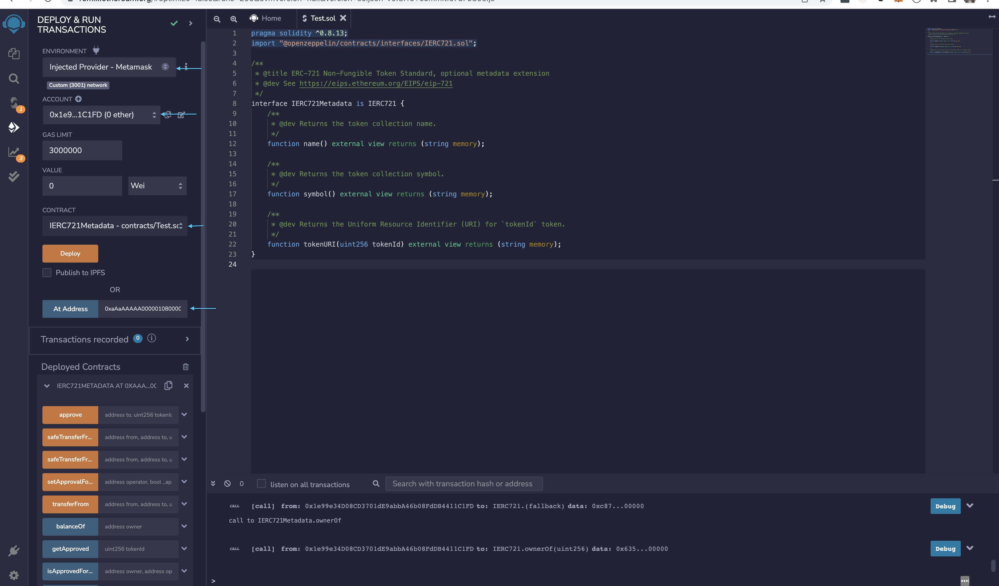
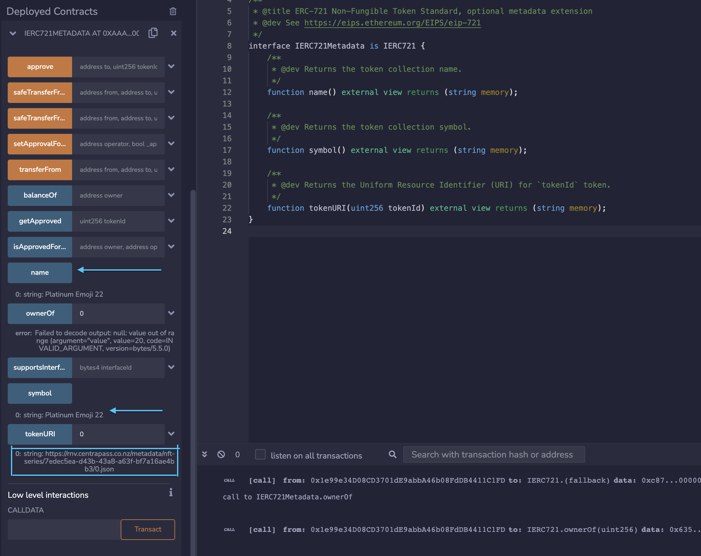
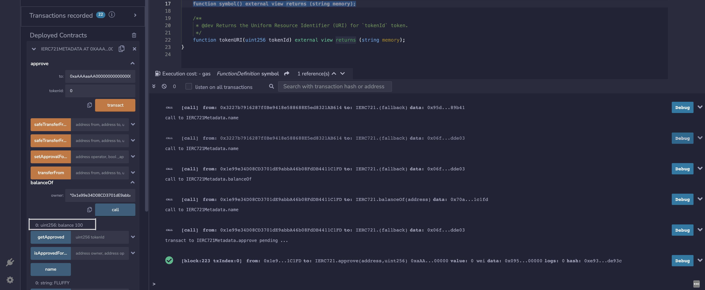
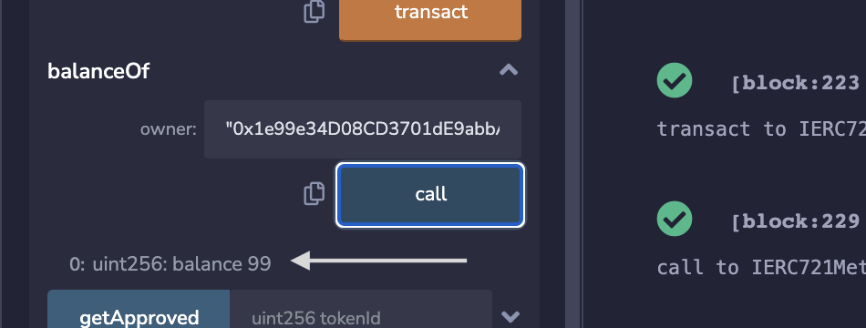
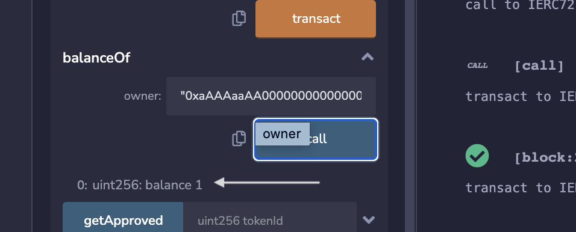

# ERC721 precompiles

## Interacting with the Runtime from EVM (Precompiles)

CENNZnet uses a precompile system to allow communication between the CENNZnet runtime and EVM contracts.
This allows native CENNZnet  NFTs to appear as regular ERC721s to ethereum tooling and contracts.

## Working with NFT

NFT implement the ERC721 abi. This allows them to be fully programmable and used anywhere a normal ERC721 token can.
To interact with a given CENNZnet NFT first derive its corresponding contract address.

On CENNZnet, NFT is combination of collection id, series id and serial number <br>
NFT - [0, 0, 0] - nft created in collection id 0, series id 0 and serial number 0

Let us take a testnet NFT for [example](https://nikau.uncoverexplorer.com/extrinsic/4845487-1)
which is at collection id - 264, series id - 0 and serial number 0

Steps to derive the contract address of this NFT
1. All NFT starts with `0xAAAAAAAA`
    The following distribution has been decided for the precompiles
    0-1023: Ethereum Mainnet Precompiles
    1024-2047 Precompiles that are not in Ethereum Mainnet but are neither CENNZnet specific
    2048-4095 CENNZnet specific precompiles
   NFT precompile addresses can only fall between
   0xAAAAAAAA00000000000000000000000000000000 - 0xAAAAAAAAFFFFFFFFFFFFFFFFFFFFFFFFFFFFFFFF
   /// The precompile for NFT series (X,Y) where X & Y are a u32 (i.e.8 bytes), 
      0xAAAAAAAA + Bytes(CollectionId) + Bytes(SeriesId)
2. Get numberToHex of collection Id and series Id and derive the contract address

```typescript 
import web3 from 'web3';
import { numberToHex } from '@polkadot/util';
const collectionId = '<YOUR_COLLECTION_ID>'; // e.g. 264
const seriesId = '<YOUR_SERIES_ID>'; // e.g. 0
const collectionIdHex = numberToHex(collectionId); // 0x0108
const seriesIdHex = numberToHex(seriesId); // 0x00
// convert to 8 hex character so collectionId becomes 0x00000108 and series id 0x00000000 
// pad with remaining 16 0s
let nftContractAddress = web3.utils.toChecksumAddress("0xAAAAAAAA" + "0x00000108" + "0x00000000" + "0000000000000000");
```
Contract address - 0xaAaAAAAA00000108000000000000000000000000

The following code snippet interacts with the testnet NFT token address using its IERC721Metadata interface.

 **Important** use solidity `^0.8.13`

```solidity
pragma solidity ^0.8.13;
import "@openzeppelin/contracts/interfaces/IERC721.sol";

/**
 * @title ERC-721 Non-Fungible Token Standard, optional metadata extension
 * @dev See https://eips.ethereum.org/EIPS/eip-721
 */
interface IERC721Metadata is IERC721 {
    /**
     * @dev Returns the token collection name.
     */
    function name() external view returns (string memory);

    /**
     * @dev Returns the token collection symbol.
     */
    function symbol() external view returns (string memory);

    /**
     * @dev Returns the Uniform Resource Identifier (URI) for `tokenId` token.
     */
    function tokenURI(uint256 tokenId) external view returns (string memory);
}

```

 

To check this NFT  on remix, we use contract at address (0xaAaAAAAA00000108000000000000000000000000)
Please ensure you are connected to the right chain on metamask (https://chainlist.org/chain/3001)



You should be able to read all the state info of any NFT on CENNZnet

To do a transaction, the metamask address used should own the NFT. 
Either transfer your CENNZnet NFT to you MetaMask wallet address or create new with eth wallet.
Lets us now look at a way of creating CENNZnet NFT via eth wallet
```
                let ethereum;
		if (typeof global.ethereum !== "undefined") {
			ethereum = global.ethereum;
		}
		let api = await Api.create({ network: "nikau" });

		const collectionName = "col1";
		await api.tx.nft
			.createCollection(collectionName, null)
			.signViaEthWallet(ethAddress, api, ethereum);

		// Once the collection is created, you will get collection id from the events, use the collection Id and create series

		const cennznetAddress = cvmToAddress(ethAddress); // find equivalent cennznet address of eth address
		const quantity = 100;
		const metadataPath = { Https: "example123.com/nft/metadata" };
		await api.tx.nft
			.mintSeries(collectionId, quantity, cennznetAddress, metadataPath, null)
			.signViaEthWallet(ethAddress, api, ethereum);

		// Set name fore the series
		await api.tx.nft
			.setSeriesName(collectionId, 0, "FLUFF")
			.signViaEthWallet(ethAddress, api, ethereum);

```

The above code creates NFT with collection id 0, series id 0 and serial number 0 on local node.
Contract address is 0xaAAAaaAA00000000000000000000000000000000 

Now you can use this NFT to do transaction like approve and transferFrom


Can look at the event on block explorer to verify or check the balance of the owner which changes from 100 to 99
<br><br>
<b>INITIAL BALANCE</b>


<br>
<B>BALANCE  AFTER TRANSFER FROM</B>




