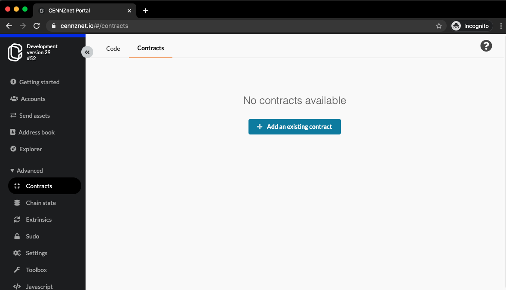

# Using Smart Contracts on CENNZnet

⚠️ smart contract functionality is still under development and is not production ready
---

A CENNZnet smart contract is some executable web assembly with an associated account on chain. It can use blockchain storage and interact with the CENNZnet runtime.

In general, any network user can invoke a smart contract provided they pay a fee (AKA gas) for the computational resources used e.g. CPU, storage, network, etc.

## When to Use a smart contract

Smart contracts allow developers to write applications which run on the blockchain. This is useful for business models which need additional services on top of what CENNZnet already provides.

## How to Write Smart Contracts

CENNZnet contracts are written in rust and cross-compiled to wasm. Parity (Substrate) provide a DSL (Domain Specific Language) to make this simpler, `Ink!`. The [ink! Smart Contracts docs](https://substrate.dev/docs/en/ecosystem/contracts/ink) give a great overview of the DSL.

There are several ways to get started with `Ink!`:
* Follow the [Substrate Contracts Workshop](https://substrate.dev/substrate-contracts-workshop/#/)
* Experiment with the [Ink! Playground Browser IDE](https://medium.com/stake-technologies/ink-playground-browser-ide-for-substrates-smart-contract-released-2b1555b085da)

## Deployment and Execution with CENNZnet UI

Navigate to [https://cennznet.io/#/contracts](cennznet.io/#/contracts)



Click the Code tab.


Click "Upload WASM", select your WASM and metadata.json (under contract ABI) and click "Upload".


Click "deploy" to deploy the uploaded WASM on an account.

* Deployment creates a new account and links it to the smart contract.
* You will need to provide an 'endowment' to keep the account alive.
* You also have the option of selecting which instantiation function to use. In our case, we have `new` or `default`.


After deployment the contract will show up on the Contracts tab.


Click on execute, and you will be able to execute code on the contract.


## Deployment and Execution with CENNZnet API

When using contracts with the API, you will need the following additional imports:

```node
const { compactAddLength, u8aToU8a} = require('@polkadot/util');
const fs = require('fs');
```

### Uploading a contract
```node
let wasm = fs.readFileSync("myContract.wasm");
await api.tx.contracts.putCode(gas_limit, compactAddLength(u8aToU8a(wasm)));
```
* `gas_limit` - specifies the maximum amount of gas to speed on uploading the contract
* `wasm` needs to be encoded appropriately for transport and have the length added.

### Instantiating a contract
```node
api.tx.contracts.instantiate(endowment, gas_limit, code_hash, compactAddLength(dataload));
```
* `endowment` - the amount of CentraPay that the created contract account will be endowed with (taken from the caller)
* `gas_limit` - specifies the maximum amount of gas to speed on instantiating the contract
* `code_hash` - the hash of the contract WASM being instantiated
* `dataload` - the instantiation function to call and its encoded arguments

### Calling a contract
```node
api.tx.contracts.call(contract_address, transfer, gas_limit, compactAddLength(dataload));
```
* `contract_address` - the address of the smart contract to call
* `transfer` - specifies an amount of CentraPay funds to transfer to the contract - this can be set to 0, but may be required by some contracts.
* `gas_limit` - specifies the maximum amount of gas to speed on calling the contract
* `dataload` - the function to call and its encoded arguments

### Additional Notes

Using the contract API is an advanced topic. It is recommended when making extrinsic calls that you subscribe to the result, and check the contents for information such as the contract hash and the instantiated address.

The metadata.json file generated when creating a contract provides the 32-bit addresses for the contract's function calls - this is important to check when using `instantiate` and `call`.


