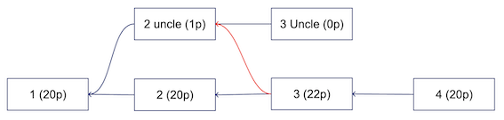
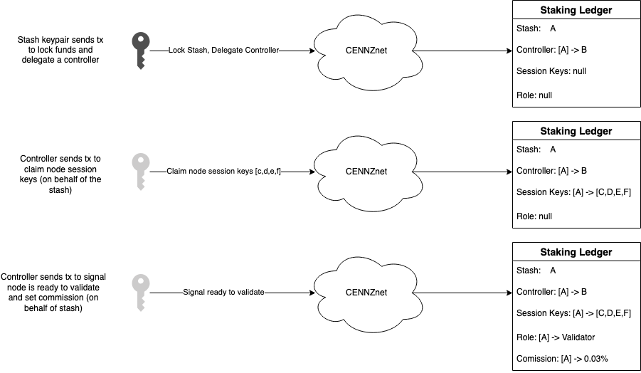

# Validator guide

CENNZnet validator nodes are responsible for authoring new blocks and voting in the finalization protocol.  

Requirements for validators are simply:
- minimum CENNZ tokens at stake
- high uptime while elected

Minimum hardware spec
- 250G storage
- 8G RAM

This guide documents the important concepts and processes involved in running a CENNZnet validator node.  

Key Links:
- [CENNZnet node telemetry](http://cennznet-telemetry.centrality.me/#/CENNZnet-Azalea)
- [CENNZnet UI](https://cennznet.io)
- [Docker Images](https://hub.docker.com/r/cennznet/cennznet/tags?page=1&ordering=last_updated)
- [MainNet DB snapshots](https://s3-ap-southeast-1.amazonaws.com/cennznet-snapshots.centralityapp.com/azalea/1.2.2/validator/index.html)
- [Polkadot Validator Guide](https://wiki.polkadot.network/docs/en/maintain-guides-secure-validator)

## Staking Overview
### Roles
CENNZnet staking uses a process called nominated proof of stake (NPoS)
allowing any CENNZ token holder to contribute to network security by taking a role of either:
1) **validator**: stakes CENNZ and maintains a validator node *or*
2) **nominator**: stakes CENNZ and votes on the best validator nodes.  

Nominators choose nodes they trust and place some of their own stake alongside the validators, in doing so they are able to earn a proportional reward should the validator do well and equally their own funds are at proportional risk of slash should the validator fail.  

### Elections
Validators are active in periods called *era*, which last ~24 hours.  
There are a finite number of slots that validators compete for.  
Nodes with the largest total CENNZ at stake are elected for active validator duty, the number of active validators is configurable by governance and as of the CENNZnet launch is `12`.  

### Rewards
The CENNZnet protocol rewards stakers (nominators & validators) at the end of every era.  
The total reward is derived from the sum of network transaction fees and an additional inflation mechanism.

Transaction fees of an era are accumulated and distributed at the end of an era at reward calculation time.    
A percentage of the accumulated fees goes to the network treasury to fund future protocol development.  
This is known as the _development take_, it is configurable by governance and currently set at 20%.  

Lastly, an inflation policy determines the base amount of CPAY to issue each era, irrespective of transaction volume.  
This ensures some reward will always exist for stakers i.e for periods with low transaction volume.  
Initially this is also important to bootstrap the supply of CPAY within the CENNZnet economy.  
Governance will configure the CPAY inflation rate by majority vote which targets a fixed % of inflation annually (or fiscal period).  

#### Reward Distribution  
A point system is used to incentivize validators to author blocks when it's their turn (determined via BABE Vrf).  
The reward payout of an era is split in proportion to a validator's accumulated "authorship" points.  

In this system, authoring a primary block is rewarded by 20 points.  
In addition, if the block references valid uncle blocks, the author also gets 2 points for each which has not been referenced before.  
Finally, 1 point goes to the author of a referenced uncle block.  

The following diagram shows an example of the authorship points process


#### Reward Calculation (worked example)
```python3
inflation_rate = 8 / 100 # % annual inflation
cennz_supply = 1_200_000_000 # at the beginning of the fiscal year
# Supposing that the duration of an era is 24h and a fiscal year is 365 days
minted_cpay_per_era = (cennz_supply * inflation_rate) / 365

transaction_fees = 2_000 # an example of the fees accumulated for the era in CPAYs
# 20% to treasury
treasury_payout = 0.2 * transaction_fees

# new minted CPAYs plus 80% of the fees go to stakers
stakers_payout = 0.8 * transaction_fees + minted_cpay_per_era

# For the sake of simplicity, let's suppose we have had 12 validators and all of them got equal chances to author 
# the blocks and they all used it. In that case the rewards would be split equally 
per_validator_payout = stakers_payout / 12
commission_rate = 5 / 100 # 5% commission for this validator
validator_commission_payout = per_validator_payout * commission_rate
validator_stake_payout = (validator_own_stake / validator_total_stake) * (per_validator_payout - validator_commission_payout)
# nominator payouts
nominator_payout = (nominator_own_stake / validator_total_stake) * (per_validator_payout - validator_commission_payout)
```

It is planned that inflation will be adjusted dynamically based on recent trends in network usage to ensure CPAY does not over (nor under) inflate in order to maintain a constant price stability / purchasing power.  

### Slashing
The primary slashable protocol offenses for validators are:  
- **Level 1**: isolated unresponsiveness, i.e. being offline for an entire epoch. No slashing, only chilling.  
- **Level 2**: concurrent unresponsiveness or isolated equivocation. Slashes a very small amount of the stake and chills.  
- **Level 3**: misconducts unlikely to be accidental, but which do not harm the network's security to any large extent. Examples include concurrent equivocation or isolated cases of unjustified voting in GRANDPA. Slashes a moderately small amount of the stake and chills.  
- **Level 4**: misconduct that poses a serious security or monetary risk to the system, or mass collusion. Slashes all or most of the stake behind the validator and chills.  

🚨 running redundant validator nodes with the same session keys is likely to cause **equivocation** slashes  
care must be taken to ensure a node is truly offline before starting a replacement.  

Slashes are bydefault deffered allowing time for potential cancellation in the case of client, protocol errors, or dispute by governance.  

for details see: https://wiki.polkadot.network/docs/en/learn-staking#slashing  
original [polkadot slashing research](https://research.web3.foundation/en/latest/polkadot/slashing/amounts.html)  

---

## Validator Keys/Accounts 🔑
CENNZnet validators closely follow the polkadot model using stash, controller, and session keys.  

**Stash** account
    This account holds the CENNZ which are at stake. It is not used other than the initial locking of funds and delegating to a *controller* account.

**Controller** account
This account acts as a proxy on behalf of the stash, to signal desire to validate, or withdraw from validator duties, or configure validator payment preferences, etc.
It does not need any CENNZ, only enough Cpay to pay for transaction fees.  

**Session** keys
These are hot keypairs used by a validating node to sign consensus protocol messages e.g. new blocks and finalization votes. Their are 4 distinct validator protocols on CENNZnet which each require a session key.  
*Note*: session keys serve a cryptographic purpose only and do not require any funds nor should they be treated as regular network accounts.

### Stash vs. Controller?
The stash + controller design is to encourage security best practices.  
It allows a low risk account (controller) to act on behalf of a high risk account (stash) to perform day-to-day staking transactions.  
This avoids unnecessary use of the stash keypair which could risk large amounts of funds, should the keypair be exposed.  


---

## Start Validating

The process to start validating is outlined as follows:

### 1) Place funds at stake
The **stash** account makes a transaction to lock its CENNZ, delegate a controller account, and set an account to receive staking reward payouts
```typescript
await api.tx.staking.bond(
  controllerAddress,
  amountToStake,
  paymentAddress, // could be any account, including controller or stash
).signAndSend(stashKeypair);
```

### 2) Start a validator node

The following command will start a node as a validator and join the CENNZnet Mainnet (Azalea).  
It will **not** create blocks or participate in consensus until its session keys are claimed on chain by a controller account.  

There are two ways to start a node:
1. Start a fresh node: this is faster to start, but you may need to wait a couple days for it to finish synchronisation, depending on the network conditions.
2. Start a node from a snapshot: this requires downloading a snapshot which is currently around 50G. Once you have downloaded the snapshot, you can start a node that’s already synchronised.

#### Starting a fresh node

Replace <MY_NODE> with a name you like and run the command.
```bash
# Warning: The following command allows for setting session key. This exposes a security risk.
# The RPC methods should be constrained to use on localhost only
# Protect your PRC port with network security rules and the firewall
docker run -p 9944:9944 -it \
  cennznet/cennznet:1.3.1 \
  --chain=/cennznet/genesis/azalea.raw.json \
  --validator \
  --name=<MY_NODE> \
  --telemetry-url 'ws://cennznet-telemetry.centrality.me:8000/submit 0' \
  --rpc-methods=Unsafe --ws-external \
  --rpc-cors=all --rpc-methods=Unsafe
```
Some bootnodes are included in the genesis/chain config, to supply additional bootnodes use: `--bootnodes=<multiaddress>`


#### Starting a node from a snapshot

1. Download the latest archive of validator nodes from [here](https://s3-ap-southeast-1.amazonaws.com/cennznet-snapshots.centralityapp.com/azalea/1.2.2/validator/index.html)
2. Unzip the archive
3. Replace the </path/to/dir/containing/the/unzipped/archive> in the following command with the path to where you’ve unzipped the archive, and <MY_NODE> with a name you like
4. Run the command


```bash
docker run -p 9944:9944 -it -v </path/to/dir/containing/the/unzipped/archive>:/mnt/cennznet \
 cennznet/cennznet:1.3.1 --validator \
 --chain=/cennznet/genesis/azalea.raw.json \
 --base-path /mnt/cennznet --unsafe-ws-external \
 --unsafe-rpc-external --rpc-cors all --rpc-methods=Unsafe \
 --telemetry-url 'ws://cennznet-telemetry.centrality.me:8000/submit 0' \
 --name <MY_NODE>
```

### 3) Claim session keys

The **controller** should make a transaction to claim some session keys on behalf of the stash.  
This signals to the rest of the network that consensus messages signed by the claimed **session** keys represent the **stash** account. 
This step essentially links a running validator node with a stash account.

It is recommended to query the node to generate new session keys and then claim them on chain e.g:
```typescript
// Ask node to generate some new session keys
// >>>> Ensure api is connected to the local validator node <<<<
const generatedSessionKeys = await api.rpc.author.rotateKeys();

// claim the session keys!
await api.tx.session.setKeys(
  generatedSessionKeys,
  // nb: 2nd arg is unused bytes for future extensions
  new Uint8Array(),
).signAndSend(controllerKeypair);
```
*note*: session keys may be rotated using this process at anytime.  


### 4) **controller** signals intent to validate
⚠️ before starting this action ensure a validator node has synchronised and has it's session keys configured. Failure to do so could mean the validator is elected and unresponsive to its duties leading to slashes.  
The node finishes synchronising when the best block number is the same or close to the target block number. The best and target block numbers can be found in the console output from the node, for example:
```bash
INFO ⚙️  Syncing 21.2 bps, target=#1140132 (1 peers), best: #532405 (0xfad8…07ea), finalized #531968 (0x1a24…d249), ⬇ 7.3kiB/s ⬆ 60 B/s   
```

Lastly, the **controller** sends a transaction to join the validator candidate pool where it may be elected for validator duties in the next era (24 hour period) provided it has enough stake versus other candidates.  

At this point the validator node should set a commission rate which is a fixed % of Cpay rewards which should always be paid to validator, the remaining % is split between nominators

```typescript
// Commission is expressed as parts-per-billion
// 
// i.e. 20,000,000 == 2%
const commission = 20000000;

await api.tx.staking.validate({ commission }).signAndSend(controllerKeypair);
```

## Nikau 🌴 TestNet
Join the testnet and try it out!
```bash
# Warning: The following command allows for setting session key. This exposes a security risk.
# The RPC methods should be constrained to use on localhost only
# Protect your PRC port with network security rules and the firewall
docker run -p 9944:9944 -it \
  cennznet/cennznet:1.3.1 \
  --chain=/cennznet/genesis/nikau.raw.json \
  --validator \
  --name=<MY_NODE> \
  --telemetry-url 'ws://cennznet-telemetry.centrality.me:8000/submit 0' \
  --rpc-methods=Unsafe --ws-external \
  --rpc-cors=all
```

### Appendix: Staking Ledger Storage



_staking ledger changes throughout the validator staking process. The controller signs some messages, however data is always linked against the stash_* 