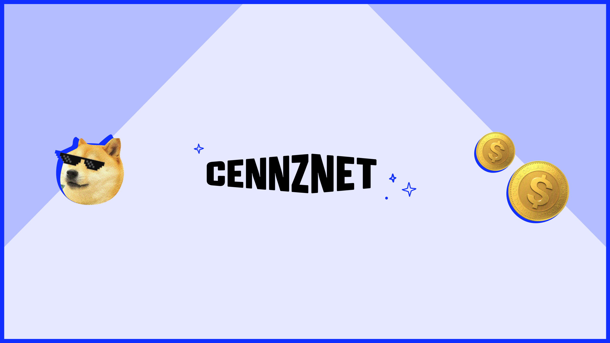

## Intro to CENNZnet

CENNZnet is a public blockchain network that powers decentralised applications (DApps) and the crypto currencies CENNZ and CPAY. It is built on top of the [Plug](https://github.com/plugblockchain/plug-blockchain/) framework.

CENNZnet features:
* ***Proof of Stake (PoS) [consensus mechanism](https://cennz.net/publications/understanding-consensus-mechanisms/)***: Facilitates a secure system while also rewarding our community. 
* ***[Dual token economy](https://cennz.net/publications/tokens-on-cennznet-understanding-the-dual-token-economy/)***: CENNZnet has 2 tokens: CPAY and CENNZ. This ensures that gas fees remain stable while the CENNZ token value can fluctuate with crypto markets.
* ***Decentralised governance***: CENNZnet functions 100% on-chain using blockchain’s built in voting mechanisms.
* ***CENNZX***: CENNZnet implements a decentralised currency exchange (CENNZX) which provides spot price trades and integrated multi-currency fee payment.

Our mission is to provide a user-first experience for both DApp developers and their end users. We aim to make blockchain based services accessible for first time builders and end users so that everyone can enjoy the increased network transparency, data privacy and reliability that decentralisation offers. 


## Community

Join our official CENNZnet Discord server 🤗

* Get CENNZnet technical support 🛠
* Meet startups and DApp developers 👯‍♂️
* Learn more about CENNZnet and blockchain 🙌
* Get updates on CENNZnet bounties and grants 💰
* Hear about the latest hackathons, meetups and more 👩‍💻

Join the Discord server by clicking on the badge below!

[](https://discord.gg/AnB3tRtkJ4)


## Handy notes
### Starting a CENNZnet node

Start a full node named `my-node` and connect it to the CENNZnet MainNet:
```bash
# via docker
$ docker run cennznet/cennznet:1.4.0 \
    --chain=/cennznet/genesis/azalea.raw.json \
    --name=my-node \
    --telemetry-url 'ws://cennznet-telemetry.centrality.me:1024 0'

# via source
git clone https://github.com/cennznet/cennznet && git checkout release/1.3.0
cd cennznet && cargo build --release
./target/release/cennznet \
    --chain=./genesis/azalea.raw.json \
    --name=my-node \
    --telemetry-url 'ws://cennznet-telemetry.centrality.me:8000/submit 0'
```

Check `my-node` is running [here](http://cennznet-telemetry.centrality.me/#/CENNZnet-Azalea).

*For more details on running a node, look at [Running a Full Node](Network-participating/Node-operating/Running-a-Full-Node).*

### Centrality hosted infrastructures
Centrality hosted CENNZnet full nodes and ecosystem services

Block explorer API: https://service.eks.centralityapp.com/cennznet-explorer-api/api/  
TestNet(Nikau)🌴 full nodes:   wss://nikau.centrality.me/public/ws  
MainNet full nodes: wss://cennznet.unfrastructure.io/public/ws  
CENNZnet UI:        https://cennznet.io/  
Block Explorer:     https://uncoverexplorer.com/  

Mainnet DB snapshots:
- https://s3-ap-southeast-1.amazonaws.com/cennznet-snapshots.centralityapp.com/azalea/1.2.2/validator/index.html  
- https://s3-ap-southeast-1.amazonaws.com/cennznet-snapshots.centralityapp.com/azalea/1.2.2/fullnode/index.html  

