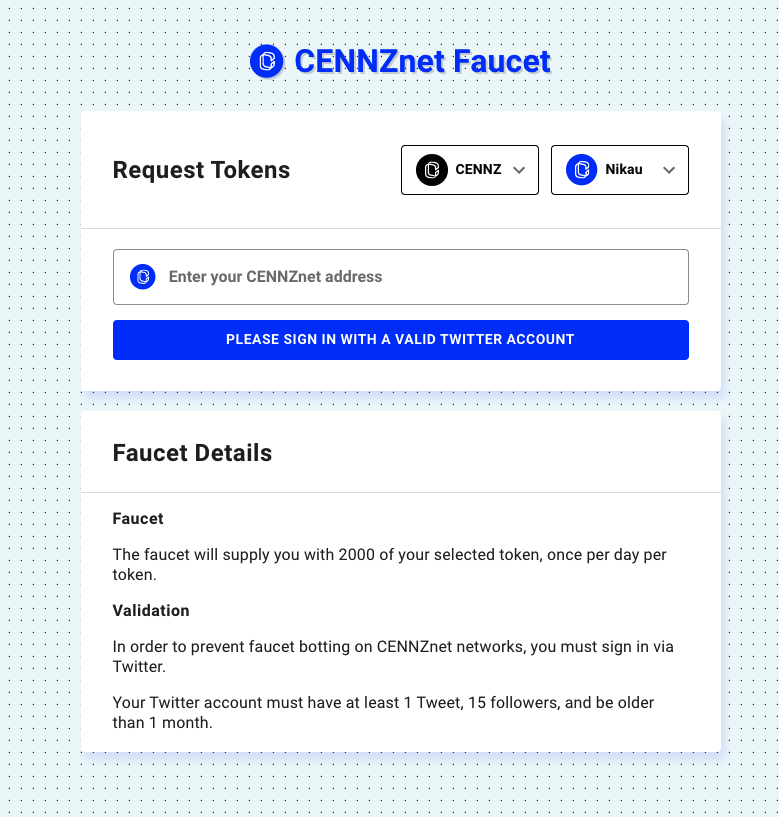
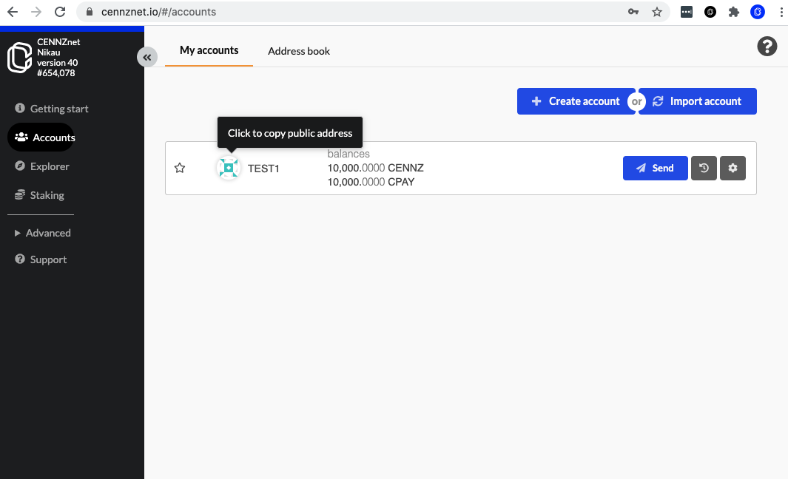

# CENNZnet Faucet

The CENNZnet Faucet is a service for issuing currencies to be used in the TestNet(Nikau), which is the [pre-production environment](/Getting-started/CENNZnet-dapp-development?id=the-pre-production-environment) to the MainNet(Alzelea).

The Faucet can be accessed from [here](https://cennznet-faucet-ui.centrality.me/).

## Using the faucet

To issue currencies to your account, you will need an account on the **TestNet**.

If you don't have an account, follow the [Intro Guide to CENNZnet.io](https://medium.com/centrality/using-cennznet-io-ac5a90f9a2cb) to learn how to create an account. **Note: please make sure you connect [CENNZnet.io](https://cennznet.io/) to the TestNet(Nikau)**.

If you already have an account on the TestNet, copy the public address from https://cennznet.io/#/accounts, and then input the address into the [faucet](https://cennznet-faucet-ui.centrality.me/). 

This will issue 10,000CENNZ and 10,000CPAY to your account. You can send more funds to your account as required.