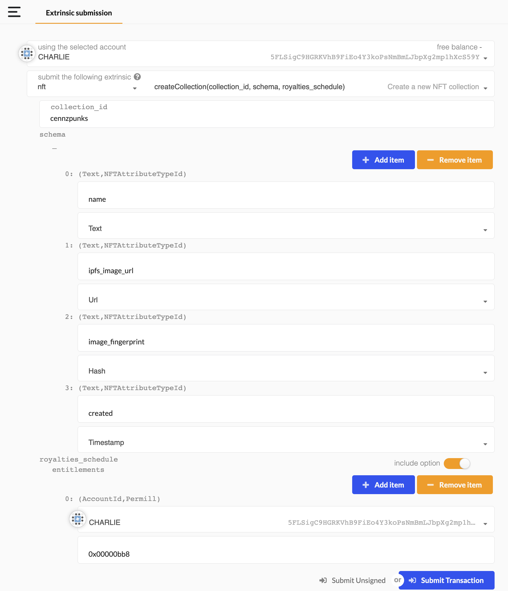
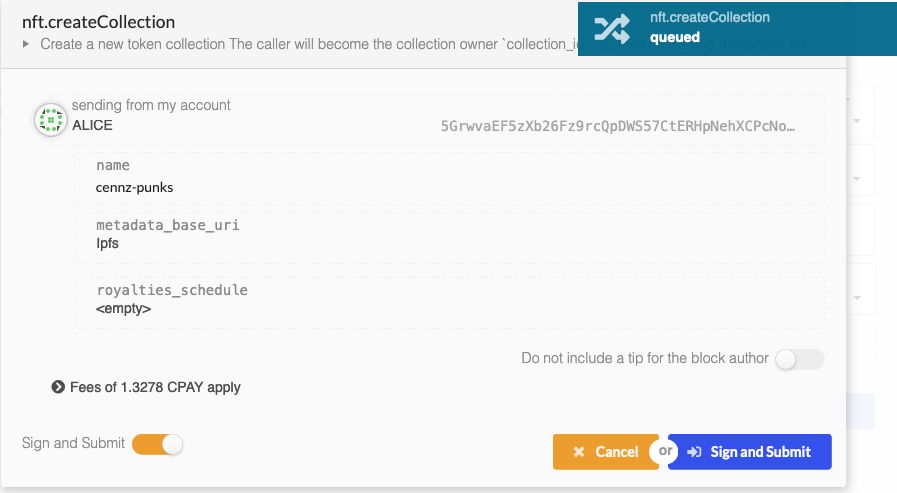
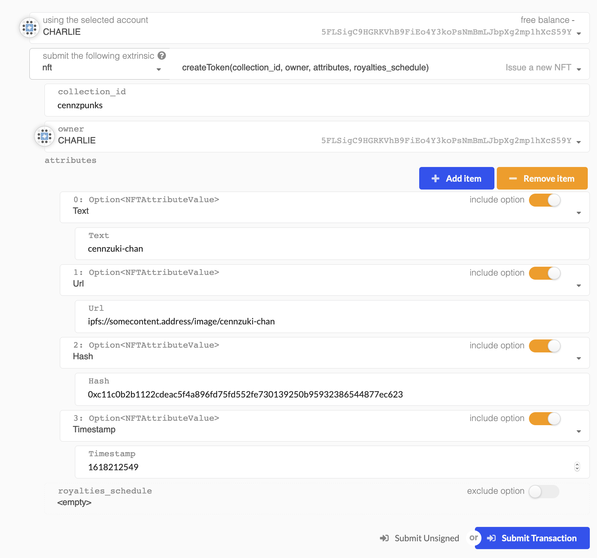
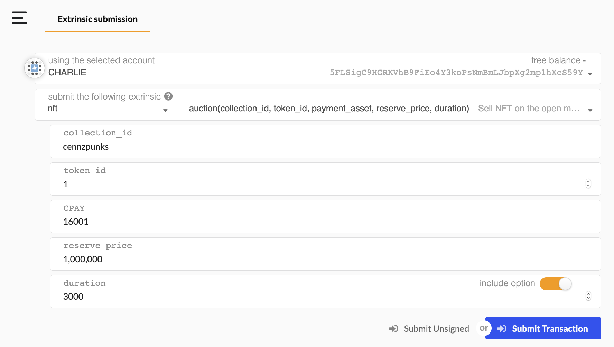
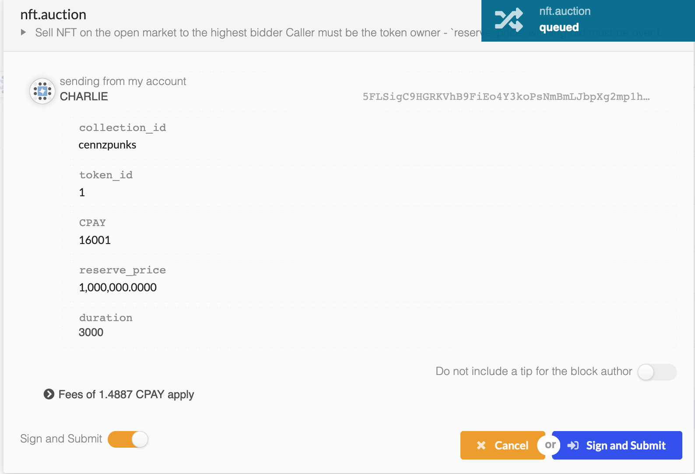

# NFT Module

The CENNZnet NFT module allows users to create custom NFTs using only the javascript API. This will allow  "point and click" UI experiences for users.

Users create NFTs in *collections*  by defining a schema of attributes all tokens in the collection could contain.

Additionally the module integrates a marketplace so that NFT owners can:
- define royalty schemes for secondary sales of tokens
- create fixed price sales
- create auction sales

---
### NFT Demo DApp
The [NFT Demo DApp](https://github.com/cennznet/NFTDemo/tree/main/nft-demo) shows how to:
* Retrieve NFT token info using the API
* Mint NFT tokens using the API
* Include assets stored on [IPFS](https://ipfs.io/) as a part of a token
* Interact with the CENNZnet Browser Extension


### Connecting to the NFT testnet

The NFT module is currently available on Nikau🌴 and Rata. Learn about the different networks from [The Networks Guide](Getting-started/CENNZnet-networks).


### Create a new collection (api)
first use the js api to get the hex-encoding for the required values
```js
console.log(util.stringToHex('test-collection'));
//> 0x746573742d636f6c6c656374696f6e

// 0.3% | parts-per-million | 3,000 / 1,000,000
console.log(api.createType('Permill', 3000).toHex());

//> 0x00000bb8

// create the collection
api.tx.nft.createCollection('test-collection', schema, null);

```
- collections should be given a utf-8 name
- collections may set royalties entitlements on all secondary sales. This can be overridden per individual tokens later on



*a new collection 'cennzpunks' is defined.*



- each cennzpunk will have: a name, creation timestamp, ipfs image url, and an image hash for verification
- also the creator 'charlie' will earn 0.3% on all future sales of any cennzpunk token

### Mint a token in the collection (collection owner only)



*minting the first token in the cennzpunks collection*
*each token in a collection is given an an auto-incrementing integer id on creation*


### Fixed price sale


*selling token 0 on the open market*
*it can be bought buy anyone for 12,345 CENNZ*


### Auction sale

*auctioning cennzpunk 1*

*the auction will close in 3000 blocks and has reserve price of 1,000,000 CPAY*



---

## Usage with cennznet.io

If the NFT related fields aren't showing up as shown in the screenshots above, you may need to add the additional types to the UI.
Go to https://cennznet.io/#/settings/developer, paste in the types below, then save and reload:
```json
{
  "NFTSchema": {
    "_": "Vec<(String, NFTAttributeTypeId)>"
  },
  "RoyaltiesSchedule": {
    "entitlements": "Vec<(AccountId, Permill)>"
  }
}
```

## Usage with the API
When using the API, use version **1.4.0-alpha.0** which includes the additional types.
If you are using an older version, add the required type definitions below.

To add additional types to the API, see [defining additional types](References/CENNZnet-API/CENNZnet-API-Overview?id=defining-additional-types)
```json
{
  "CollectionId": "String",
  "TokenId": "u32",
  "NFTAttribute": {
    "name": "NFTAttributeName",
    "value": "NFTAttributeValue"
  },
  "NFTAttributeValue": {
    "_enum": {
      "i32": "i32",
      "u8": "u8",
      "u16": "u16",
      "u32": "u32",
      "u64": "u64",
      "u128": "u128",
      "Bytes32": "[u8; 32]",
      "Bytes": "Bytes",
      "String": "String",
      "Hash": "[u8; 32]",
      "Timestamp": "Moment",
      "Url": "String"
    }
  },
  "NFTAttributeName": "String",
  "NFTAttributeTypeId": {
    "_enum": {
      "i32": "",
      "u8": "",
      "u16": "",
      "u32": "",
      "u64": "",
      "u128": "",
      "Bytes32": "",
      "Bytes": "",
      "String": "",
      "Hash": "",
      "Timestamp": "",
      "Url": ""
    }
  },
  "NFTSchema": {
    "_": "Vec<(String, NFTAttributeTypeId)>"
  },
  "RoyaltiesSchedule": {
    "entitlements": "Vec<(AccountId, Permill)>"
  },
  "Listing": {
    "_enum": {
      "DirectListing": "DirectListing",
      "AuctionListing": "AuctionListing"
    }
  },
  "DirectListing": {
    "payment_asset": "AssetId",
    "fixed_price": "Balance",
    "close": "BlockNumber",
    "buyer": "AccountId"
  },
  "AuctionClosureReason": {
    "_enum": {
      "ExpiredNoBids": null,
      "SettlementFailed": null,
      "VendorCancelled": null
    }
  }
}
```

## Schema & Example Queries

Supported NFT data types are listed here:
```rust
i32
u8
u16
u32
u64
u128
Bytes32
Bytes
String
Hash
Timestamp
Url
```
Some are just nice aliases which give meaning to the data e.g. Url is a String.

Any application can query an NFT collection's registered schema and make sense of it's tokens
```typescript
let schema = (await api.query.nft.collectionSchema('cennzpunks')).unwrap();
console.log(schema.toHuman());

/**
[
  [ 'name', 'Text' ],
  [ 'ipfs_image_url', 'Url' ],
  [ 'image_fingerprint', 'Hash' ],
  [ 'created', 'Timestamp' ]
]
**/

// get token 0
let token0 = (await api.query.nft.tokens('cennzpunks', 0));
console.log(token0.toHuman());
/**
[
  { Text: 'cennzuki-chan' },
  { Url: 'ipfs://somecontent.address/image/cennzuki-chan' },
  {
    Hash: '0xc11c0b2b1122cdeac5f4a896fd75fd552fe730139250b95932386544877ec623'
  },
  { Timestamp: '1,618,212,549' }
]
**/

// All token Ids owned by the account in a given collection
let owned = (await api.query.nft.collectedTokens('cennzpunks', '5FLSigC9HGRKVhB9FiEo4Y3koPsNmBmLJbpXg2mp1hXcS59Y'));
/**
 [0, 1]
**/
```
