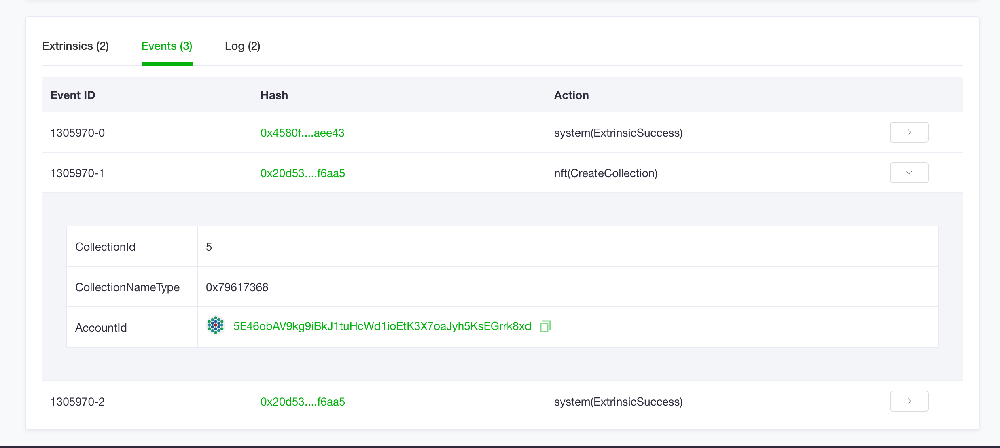
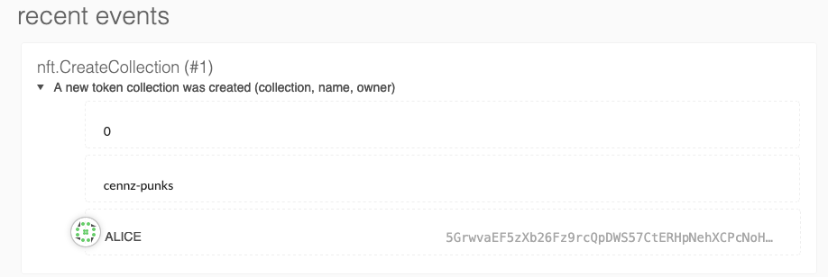
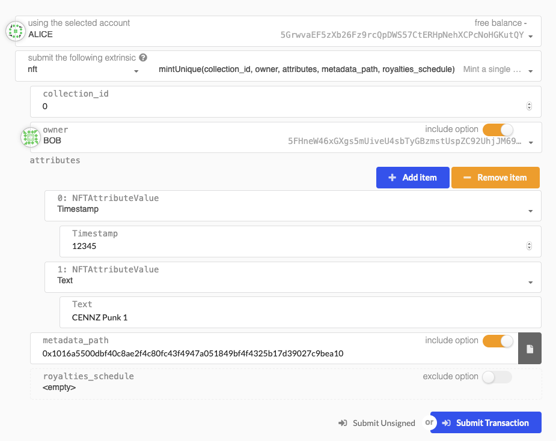
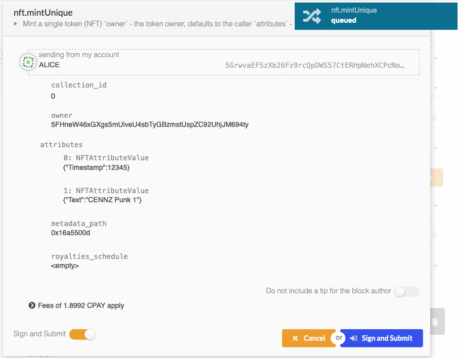

# NFT Module 🃏

The CENNZnet NFT module allows users to create custom NFTs using only the javascript API and simple transactions, without the need for smart contracts.  

The module has an integrated marketplace allowing NFT owners to:  
- define royalty schemes for secondary sales of tokens
- create fixed price sales  
- create auction sales  

## NFT Demo DApp
The [NFT Demo DApp](https://github.com/cennznet/NFTDemo) shows how to:
* Retrieve NFT token info using the API
* Mint NFT tokens using the API
* Include assets stored on [IPFS](https://ipfs.io/) as a part of a token
* Interact with the CENNZnet Browser Extension

## Collections, Series, and Serial Numbers

To allow the creation and growth of many possible NFTs, CENNZnet organizes tokens
by collection, series, and serial number.  

*__Collections__* - are namespaces for groups of related tokens. Every NFT belongs to exactly 1 collection.  
Tokens within the same collection can be traded easily and the collection owner  
can define certain business rules for its tokens e.g. royalties (more features coming soon)  

*__Series__* - Represent "editions" of specific tokens  
Every NFT belongs to exactly 1 series, a series may have 1 or more tokens  
A series of 1 token i.e `1-of-1` represents an NFT (unique)  
A series of multiple tokens `1-of-N` represents a semi-fungible token (SFT)  
SFTs allow many copies of the same token to exist (distinguishable by an additional serial number)

*__Serial Numbers__*
serial numbers are unique per _series_

*__Example__*: A token ID: `[1,3,3]` belongs to collection: `1`, series: `3`, with serial number `3`

---

### Creating a Collection

First, define a collection to hold your tokens  
- collections should be given a utf-8 name  
- collections may set royalties entitlements on all secondary sales.  
This can be overridden per individual tokens later on  

**important** each new collection is given an integer ID  
The collection ID should be used to reference it in future transactions  
Check a block explorer to find your collection Id after the transaction e.g. https://uncoverexplorer.com  

Here we create a collection named 'cennz-punks'  
We state the metadata URI for this collection will be stored on the 'ipfs' protocol  (see [this](https://github.com/cennznet/cennznet/issues/442#issue-891616973) for more info on metadata URIs)  

*creating the collection*


*signing the transaction*


Find the block with your transaction on [UNcover](https://uncoverexplorer.com/) and check the "events" view

Or the "explorer" tab on cennznet.io



### Mint a unique token in the collection (collection owner only)

When creating a token you can define its data fields or _attributes_  
The token can be minted to another address.  
This enables use cases like 'lazy minting' where an NFT is only created after payment is received  

*minting the first token in the cennz-punks collection*  
*it has a timestamp and name 'CENNZ Punk 1'*  


*The tokens attributes/data are shown*

---

## Token Attributes & Example Queries

Supported NFT data types are listed here:
```rust
i32
u8
u16
u32
u64
u128
Bytes32
Bytes
String
Hash
Timestamp
Url
```
Some are just nice aliases which give meaning to the data e.g. Url is a String.

Query a collection's tokens
```js
let collectionId = 0;
let collectionName = (await api.query.nft.collectionName(collectionId));
console.log(collectionName);
// Get collection tokens
let tokens = (await api.derive.nft.tokenInfoForCollection(collectionId));
console.log(tokens);

// get individual token info by Id
let collectionId = 0;
let seriesId = 0;
let serialNumber = 0;
let token0 = (await api.derive.nft.tokenInfo(tokenId));
console.log(token0.toHuman());

// All token Ids owned by an account in a given collection
let owner = '5FLSigC9HGRKVhB9FiEo4Y3koPsNmBmLJbpXg2mp1hXcS59Y';
let owned = (await api.query.nft.collectedTokens(collectionId, owner));
```
