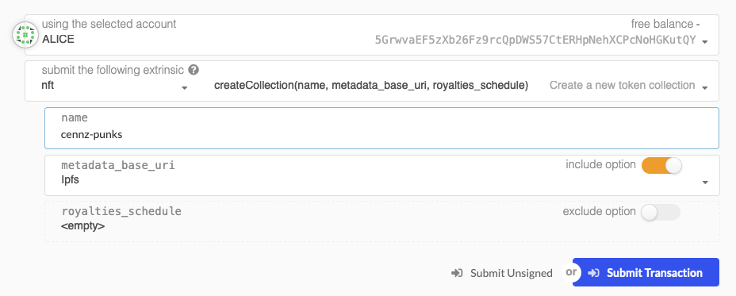

# NFT Module

The CENNZnet NFT module allows users to create custom NFTs using only the javascript API.  
This allows  "point and click" UI experiences requiring 0-smart contracts.  

Users create NFTs in *collections*  by defining a schema of attributes all tokens in the collection could contain.

Additionally the module integrates a marketplace so that NFT owners can:
- define royalty schemes for secondary sales of tokens
- create fixed price sales
- create auction sales

---

### Connecting to the NFT testnet
**NFT testnet here:** [wss://kong2.centrality.me/public/rata/ws](wss://kong2.centrality.me/public/rata/ws)

The NFT module is currently available on Rata. You can connect to it by putting in the above endpoint as Custom Endpoint in the 'Select Network' window in cennznet.io.

If you need to run a local node that connects to Rata, use the command [here](Network-participating/Node-operating/Running-a-Full-Node?id=connecting-to-rata-for-development).

### Creating a collection
- collections should be given a utf-8 name
- collections may set royalties entitlements on all secondary sales. This can be overridden per individual tokens later on



*a new collection 'cennzpunks' is defined.*


- each cennzpunk will have: a name, creation timestamp, ipfs image url, and an image hash for verification
- also the creator 'charlie' will earn 0.3% on all future sales of any cennzpunk token

### Mint a token in the collection (collection owner only)


*minting the first token in the cennzpunks collection*
*each token in a collection is given an an auto-incrementing integer id on creation*


### Fixed price sale


*selling 'cennzpunk' 0 on the open market*
*it can be bought by anyone for 12,345 CENNZ*


### Auction sale

*Auctioning 'cennzpunk' 1*


*The auction will close in 3000 blocks and has reserve price of 1,000,000 CPAY*

---

## Usage with cennznet.io

If the NFT related fields aren't showing up as shown in the screenshots above, you may need to add the additional types to the UI.
Go to https://cennznet.io/#/settings/developer, paste in the types below, then save and reload:
```json
{
  "NFTSchema": {
    "_": "Vec<(String, NFTAttributeTypeId)>"
  },
  "RoyaltiesSchedule": {
    "entitlements": "Vec<(AccountId, Permill)>"
  }
}
```

## Usage with the API
When using the API, use version **@cennznet/api@1.4.0-alpha.0** which includes the additional types.
If you are using an older version, add the required type definitions below.

To add additional types to the API, see [defining additional types](References/CENNZnet-API/CENNZnet-API-Overview?id=defining-additional-types)
<details>
<summary>
Additional Types
</summary>
<pre>
{
  "CollectionId": "String",
  "TokenId": "u32",
  "NFTAttribute": {
    "name": "NFTAttributeName",
    "value": "NFTAttributeValue"
  },
  "NFTAttributeValue": {
    "_enum": {
      "i32": "i32",
      "u8": "u8",
      "u16": "u16",
      "u32": "u32",
      "u64": "u64",
      "u128": "u128",
      "Bytes32": "[u8; 32]",
      "Bytes": "Bytes",
      "String": "String",
      "Hash": "[u8; 32]",
      "Timestamp": "Moment",
      "Url": "String"
    }
  },
  "NFTAttributeName": "String",
  "NFTAttributeTypeId": {
    "_enum": {
      "i32": "",
      "u8": "",
      "u16": "",
      "u32": "",
      "u64": "",
      "u128": "",
      "Bytes32": "",
      "Bytes": "",
      "String": "",
      "Hash": "",
      "Timestamp": "",
      "Url": ""
    }
  },
  "NFTSchema": {
    "_": "Vec<(String, NFTAttributeTypeId)>"
  },
  "RoyaltiesSchedule": {
    "entitlements": "Vec<(AccountId, Permill)>"
  },
  "Listing": {
    "_enum": {
      "DirectListing": "DirectListing",
      "AuctionListing": "AuctionListing"
    }
  },
  "DirectListing": {
    "payment_asset": "AssetId",
    "fixed_price": "Balance",
    "close": "BlockNumber",
    "buyer": "AccountId"
  },
  "AuctionClosureReason": {
    "_enum": {
      "ExpiredNoBids": null,
      "SettlementFailed": null,
      "VendorCancelled": null
    }
  }
}
</pre>
</details>

## Schema & Example Queries

Supported NFT attribute types are:
```rust
i32
u8
u16
u32
u64
u128
Bytes32
Bytes
String
Hash
Timestamp
Url
```
Some are nice aliases which give meaning to the data e.g. Url is a String.

### Create a Collection
```js
import { Api } from '@cennznet/api';
import { keyring } from '@polkadot/keyring';

let api = Api.create('ws://localhost:9944');
let collectionOwner = new Keyring({ 'type': 'sr25519' }).addFromUri('//ExampleCollectionOwner');

// 0.3% | parts-per-million | 3,000 / 1,000,000
let royaltyFee = api.createType('Permill', 3000);

let royalties = {
  entitlements: [
    [collectionOwner.address, royaltyFee]
  ]
}

// create the collection
let baseMetadataUri = 'https://example.com/metadata';
await api.tx.nft
  .createCollection(
    'test-collection',
    schema,
    baseMetadataUri,
    null
  ).signAndSend(collectionOwner);

```


### Query Examples
Any application can query an NFT collection's registered schema and make sense of it's tokens
```js
let schema = (await api.query.nft.collectionSchema('cennzpunks')).unwrap();
console.log(schema.toHuman());

/**
[
  [ 'name', 'Text' ],
  [ 'ipfs_image_url', 'Url' ],
  [ 'image_fingerprint', 'Hash' ],
  [ 'created', 'Timestamp' ]
]
**/

// get token 0
let token0 = (await api.query.nft.tokens('cennzpunks', 0));
console.log(token0.toHuman());
/**
[
  { Text: 'cennzuki-chan' },
  { Url: 'ipfs://somecontent.address/image/cennzuki-chan' },
  {
    Hash: '0xc11c0b2b1122cdeac5f4a896fd75fd552fe730139250b95932386544877ec623'
  },
  { Timestamp: '1,618,212,549' }
]
**/

// All token Ids owned by the account in a given collection
let owned = (await api.query.nft.collectedTokens('cennzpunks', '5FLSigC9HGRKVhB9FiEo4Y3koPsNmBmLJbpXg2mp1hXcS59Y'));
/**
 [0, 1]
**/
```
