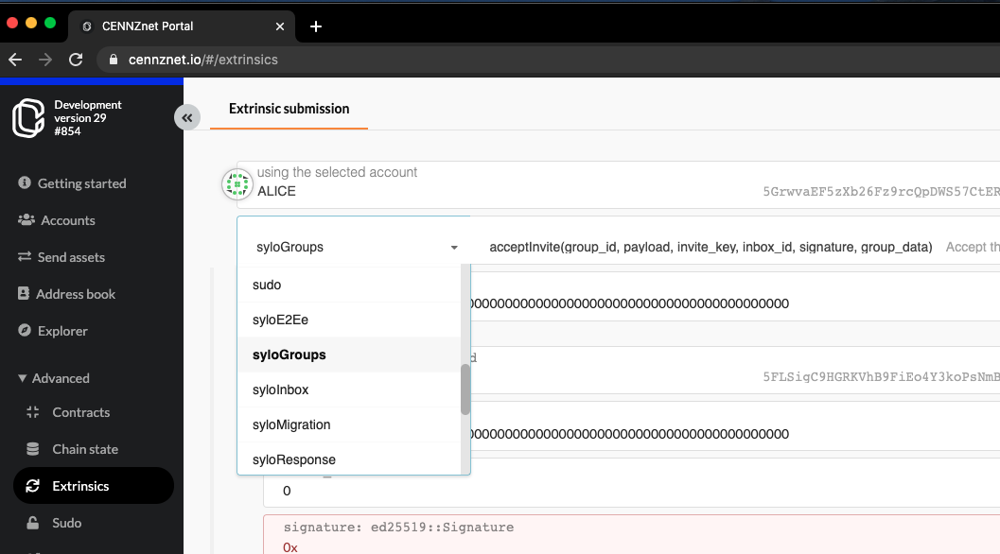

# Sylo runtime modules

This documents the API to the Sylo runtime modules on CENNZnet. To access the API for building a D'App on the Sylo platform, see the [official Sylo documentation](https://developers.sylo.io/sylo-protocol#api-reference).

The Sylo runtime modules are build to support the [Signal Protocol](https://en.wikipedia.org/wiki/Signal_Protocol).

## Accessing Sylo Runtime Modules with the UI

There are several Sylo runtime modules:
* syloE2Ee - exposes device registration along with the PreBundleKeyPairs required for signal protocol.
* syloGroups - an API for creating and managing user groups
* syloInbox - an API for sending and receiving binary data into a messaging system
* syloResponse - an API for managing the response to removing PreKeyBundles
* syloVault - a simple key-value pair storage for binary data, primarily used by syloGroups

These can be accessed from the drop down menu on [cennznet.io/#/extrinsics](https://cennznet.io/#/extrinsics)



Sylo storage can be accessed on [cennznet.io/#/chainstate](https://cennznet.io/#/chainstate), and select any of the `sylo` modules from the drop-down menu. 

## Accessing Sylo Runtime Modules with the API

The javascript API provides the same interfaces available through the UI.

```node
/// Sylo E2Ee
/// - Extrinsics
api.tx.syloE2Ee.registerDevice(device_id, pre_key_bundles);
api.tx.syloE2Ee.replenishPkbs(device_id, pre_key_bundles);
api.tx.syloE2Ee.withdrawPkbs(request_id, wanted_pre_key_bundles);

/// - State
api.query.syloE2Ee.preKeyBundles((account_id, device_id)); // Returns `Vec<PreKeyBundle>`
```
```node
/// Sylo Groups
/// - Extrinsics
api.tx.syloGroups.acceptInvite(group_id, payload, invite_key, inbox_id, signature, group_data);
api.tx.syloGroups.createGroup(group_id, meta, invites, group_data);
api.tx.syloGroups.createInvites(group_id, invites);
api.tx.syloGroups.leaveGroup(group_id, group_key);
api.tx.syloGroups.revokeInvites(group_id, invite_keys);
api.tx.syloGroups.updateMember(group_id, meta);
api.tx.syloGroups.upsertGroupMeta(group_id, meta);

/// - State
api.query.syloGroups.groups(group_id); // Returns `Group`
api.query.syloGroups.memberships(account_id); // Returns `Vec<AccountId, u32>`
api.query.syloGroups.memberDevices(group_id); // Returns `Vec<Hash>`
```

```node
/// Sylo Inbox
/// - Extrinsics
api.tx.syloInbox.addValue(peer_id, value);
api.tx.syloInbox.deleteValues(value_ids);

/// - State
api.query.syloInbox.nextIndexes(account_id); // Returns `MessageId`
api.query.syloInbox.values(account_id); // Returns `Vec<(MessageId, Message)>`
```

```node
/// Sylo Response
/// - Extrinsics
api.tx.syloResponse.removeResponse(request_id);

/// - State
api.query.syloResponse.responses((account_id, request_id)); // Returns `Response`
```

```node
/// Sylo Vault
/// - Extrinsics
api.tx.syloVault.deleteValues(keys);
api.tx.syloVault.upsertValue(key, value);

/// - State
api.query.syloVault.vault(account_id); // Returns `Vec<(VaultKey, ValueValue)>`
```

```node
/// Sylo Device
/// - State
api.query.syloDevice.devices(account_id); // Returns `Vec<DeviceId>`
```