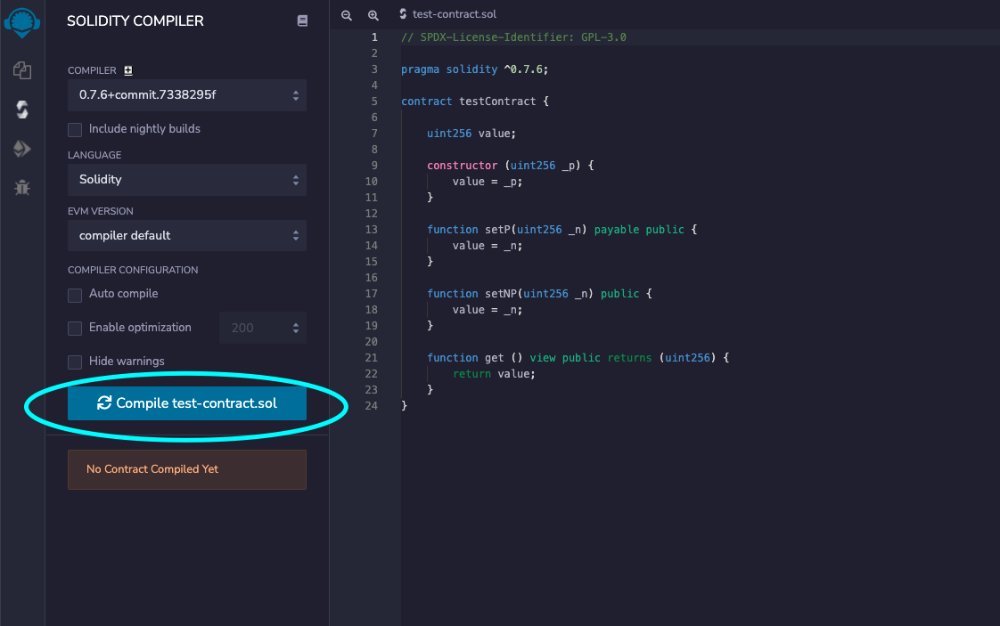
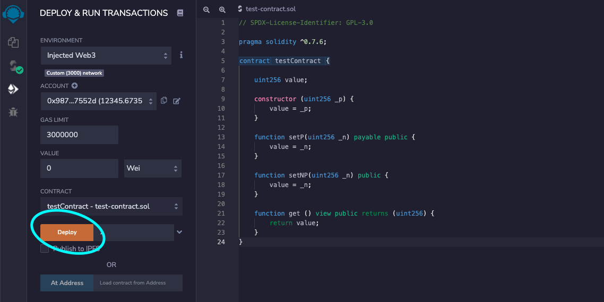
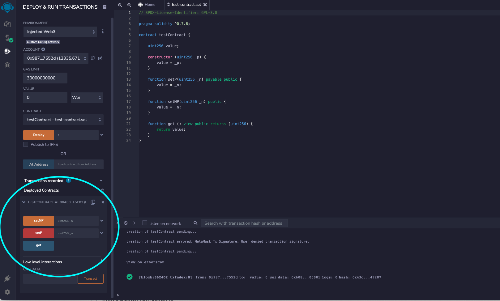

# Using Smart Contracts on CENNZnet

[Smart Contracts](https://ethereum.org/en/developers/docs/smart-contracts/) are the building blocks of DApps on the Ethereum blockchain. Over the years, the Ethereum community has built a large amount of development tools and frameworks. To take advantage of the Ethereum ecosystem, we have added Smart Contracts support to CENNZnet.

This guide shows you how to deploy and execute Smart Contracts natively on CENNZnet. While you can use any Ethereum dev tools on CENNZnet, we will be using the [Remix IDE](https://remix.ethereum.org/) in this guide.

CENNZnet's EVM runtime module provides the environment to run Smart Contracts. See the [EVM module documentation](runtime-modules/EVM) for more details on the fees and considerations when using Smart Contracts.

## Migrating from Ethereum to CENNZnet demo video
https://youtu.be/f4wblOufvs4

## Prerequisites
Install [MetaMask](https://metamask.io/)

## Connect MetaMask to CENNZnet
Since the Remix IDE integrates with MetaMask nicely, we are going to use MetaMask as the wallet for CENNZnet. This allows us to sign CENNZnet transactions with MetaMask, which is required by deploying and executing contracts.

First, connect MetaMask to CENNZnet.

Please refer to this article(to be added to the Knowledge Hub) for instructions on how to add CENNZnet to MetaMask.

## Deploying a contract

You can use any Ethereum dev tool for deploying a contract. In this example, we’ll use the Remix IDE. 
Follow the [Remix docs](https://remix-ide.readthedocs.io/en/latest/create_deploy.html.) for more details on the Remix IDE 

### Compile the contract

Go to the SOLIDITY COMPILER tab in Remix and compile the contract:

### Deploy the contract

Go to the DEPLOY & RUN TRANSACTIONS tab in Remix.

*Select Injected Web3 for Environment.* This will connect to the network that MetaMask is connected to. MetaMask should now be configured to CENNZnet.

## Execute a contract

Once deployed, you can use the DEPLOY & RUN TRANSACTIONS tab in Remix to interact with the contract.

